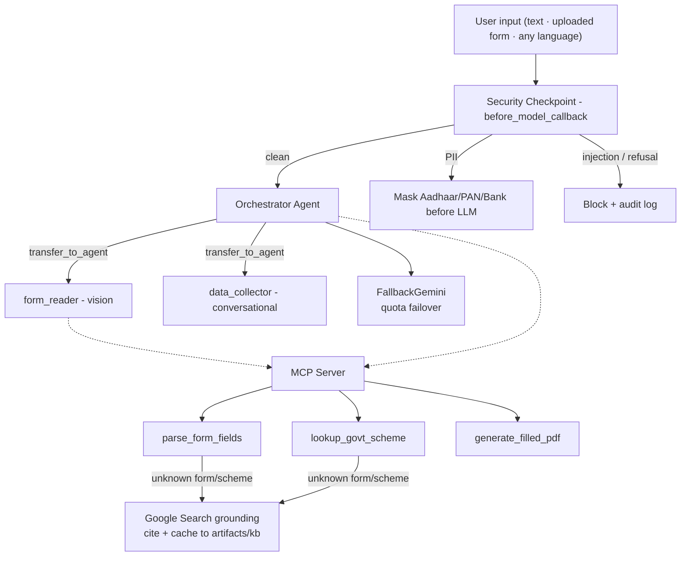

# Sugam Form Filler - Submission Writeup

## Problem Statement
Official paperwork in India (KYC, government schemes, bank forms) is intimidating — especially for
elderly citizens, first-time applicants, or people who are not comfortable in English. A single
wrong field can mean a rejected application. There is a real need for an accessible, conversational
interface that can look at a form, explain it in the user's **own language**, and guide them
through filling it out safely.

## Solution Architecture
Sugam is a **Google ADK multi-agent** system running on **Gemini 2.5 Flash** (vision-capable),
with an **MCP server** exposing domain tools.

A purpose-built web UI (`frontend/` + `app/server.py`) sits in front of this, serving the
SPA and ADK's own agent API from one process on one port.

## Concepts Used
- **ADK LlmAgent + sub-agents**: A root `orchestrator` coordinates two specialists — `form_reader`
  (reads uploaded documents with vision) and `data_collector` (gathers answers conversationally).
- **`transfer_to_agent` delegation**: The orchestrator hands control to a sub-agent via ADK's
  built-in transfer. Because a transferred sub-agent inherits the full session history, `form_reader`
  can see the uploaded image — something a text-only tool call cannot do.
- **`before_model_callback` security checkpoint**: Attached to all three agents, so PII masking and
  injection/consent checks run before *every* model call.
- **MCP Server** (`app/mcp_server.py`): Hosts real domain tools over stdio transport.
- **Multilingual instructions**: A shared language rule makes every agent reply in the user's
  language.

## Requirement Compliance (Concept Mapping)
Every mandatory concept is fulfilled with the current, stable ADK APIs. Where the original
scaffold targeted an experimental Workflow-graph API that did not run, the equivalent capability
is delivered with the supported mechanism:

| Mandatory concept | How Sugam fulfils it |
|---|---|
| **ADK Multi-Agent (2+ LlmAgents)** | `orchestrator` + `form_reader` + `data_collector` in `app/agent.py`. |
| **Orchestrator → sub-agent delegation** | ADK-native `sub_agents` + `transfer_to_agent` (forwards full context incl. uploaded images — an `AgentTool` text call cannot). |
| **Shared state / routing between agents** | Sub-agents share the ADK session/`InvocationContext`; the orchestrator + security callback implement the "gate then route" flow the graph was meant to express. |
| **MCP Server, 3+ tools, in 2+ agents** | `app/mcp_server.py` (stdio) with `parse_form_fields`, `lookup_govt_scheme`, `generate_filled_pdf`; `MCPToolset` wired into `orchestrator` and `form_reader`. |
| **Security checkpoint (PII + injection + audit)** | `security_checkpoint()` as a `before_model_callback` on all three agents — runs before *every* model call, stronger than a single graph node. |
| **Human-in-the-loop** | `data_collector` asks one field at a time via the chat turn loop. |
| **Agents CLI scaffold** | `agents-cli-manifest.yaml` + `GEMINI.md` present; `make playground` / `adk web app` runs. |

## Security Design
Handling sensitive user data requires strict guardrails, all implemented in `security_checkpoint`
in `app/agent.py`:
1. **PII Masking** — regexes detect and mask Aadhaar, PAN, and bank-account numbers, rewriting the
   request *in place* so the raw values never reach the LLM.
2. **Prompt-Injection Blocking** — keyword detection short-circuits with a "Security Policy
   Violation" response (returning an `LlmResponse` skips the model call entirely).
3. **Consent Enforcement** — a domain rule that blocks the flow if the user explicitly refuses
   consent.
4. **Audit Logging** — every decision is logged as JSON to `artifacts/audit.log` and streamed to
   the terminal, so redactions and blocks are visible live during a demo. The same events are
   mirrored onto an in-memory bus (`app/security_events.py`) that the web UI polls, so the user
   — not just the developer watching a console — can see the checkpoint working.

## MCP Server Design
`app/mcp_server.py` exposes three working tools:
- `parse_form_fields` — returns the real required-field list (with plain-language descriptions) for
  known forms (KYC, PAN, Aadhaar) from a curated knowledge base.
- `lookup_govt_scheme` — returns real benefit / eligibility / document details for common schemes
  (PM-KISAN, Ayushman Bharat, PMAY, Ujjwala, Sukanya Samriddhi), with fuzzy name matching.
- `generate_filled_pdf` — generates an actual PDF (via `fpdf2`) from the collected data and saves it
  to `artifacts/`, with Unicode-font support so native-language values render.

### Self-healing knowledge base
A curated catalog that dead-ends on anything unlisted would make the demo brittle and the
product useless. So the catalog is a **fast cache, never a limit**: when a scheme or form is
missing, `research_govt_scheme` / `research_form_fields` look it up live via **Gemini + Google
Search grounding**, cite the official sources, and persist the verified result to
`artifacts/kb/*.json` — shared with the MCP subprocess, so it is an instant offline hit next
time. Coverage is effectively unbounded; the seed is just the trusted fast path.

### Filling the user's actual form
`fill_uploaded_pdf` writes answers onto the uploaded document, choosing a placement strategy
per form: AcroForm fields → comb/box grids → text-layer label anchors → **Tesseract OCR label
anchors** → **Gemini vision bounding boxes**. The first four cost no vision call at all. Two
decisions carry the accuracy:
- The OCR-vs-vision choice is made **locally**, by fuzzy-matching collected field names against
  OCR labels — so a noisy phone photo skips straight to vision with nothing wasted.
- The vision model returns a **position, never the text** (`{index, box_2d}`); the answer is
  looked up from our own collected data. Asked to echo the value, it wrote the field *label*
  into the blank instead of the answer — returning only a position removes that failure mode.

### Staying alive on free-tier quota
One completed form is many model requests. `app/fallback_model.py` wraps the single model
object all three agents share, so a spent daily quota (429) or an unavailable model name (404)
fails over to the next model in the chain instead of stranding the user mid-form. Every switch
is audited as a `model_failover` event, so the degradation is visible to an operator without
ever being pushed at the user.

## Vision + Multilingual Flow
- **Vision**: When the user uploads a form, the orchestrator transfers to `form_reader`, whose
  Gemini model reads the actual document and explains each field.
- **Native language**: The user can converse in Hindi, Tamil, Bengali, and other Indian languages;
  explanations, questions, and messages all come back in that language.

## Human-in-the-Loop Flow
`data_collector` asks for one field at a time and waits for the user's reply in the chat UI, rather
than requesting twenty fields at once — a genuine step-by-step HITL experience. When collection is
complete it transfers back to the orchestrator to generate the PDF.

## The Sugam Web App
The ADK dev UI is an event inspector for developers; the people this product serves are on a
cheap phone, in bright sunlight, and may read slowly or not at all. `frontend/` (React 19 +
Vite + Tailwind v4, ~151 KB gzipped) is built for them, and `app/server.py` serves it from the
same process as the agent — it calls ADK's own `get_fast_api_app(web=False)`, so sessions,
`/run_sse` streaming and artifact storage are ADK's, not a reimplementation. One process, one
port, no Node in production.

What it adds that the dev UI structurally cannot:
- **Language first** — ten languages, each shown in its own script; picking one opens the
  conversation in that language. Urdu renders right-to-left.
- **Voice in and out** — speak your answer, and press Listen to hear a reply. Speech output is
  hybrid by necessity: Chrome ships voices for only a few of the ten languages, and reading
  Tamil with an English voice is gibberish, so the client falls back to server-side Gemini TTS
  (`/api/tts`, LRU-cached) only for languages with no real on-device voice.
- **A live Trust panel** — PII masking happens in a `before_model_callback`, *before* the model
  call, and a blocked prompt short-circuits the call entirely, so neither ever appears in the
  agent's event stream. `app/security_events.py` mirrors them onto an in-memory bus so the
  person being protected can watch the protection happen.
- **The filled form, visible inline** — a server-rendered PNG preview in the conversation, with
  Download beside it. No separate artifacts panel to find.

## Demo Walkthrough
1. **Upload + native language** — user uploads a KYC form and asks in Hindi; `form_reader` reads it
   with vision and explains the fields in Hindi.
2. **Conversational collection** — `data_collector` gathers details one field at a time.
3. **PII masking** — an Aadhaar number in the input is redacted before the LLM sees it.
4. **Injection/consent block** — a bypass/refusal attempt is stopped with a Security Policy Violation.
5. **Real PDF** — `fill_uploaded_pdf` writes the answers onto the user's own form (or
   `generate_filled_pdf` produces a labelled data sheet), and it appears inline with a preview.

## What is Real vs. Representative
- **Real**: vision reading, multilingual conversation, multi-agent delegation, PII masking,
  injection/consent blocking, audit logging, the three MCP tools, PDF generation, filling the
  user's own uploaded form, cross-model quota failover, and the grounded self-healing knowledge
  base.
- **Curated + grounded**: the form/scheme catalogs are a curated **offline** seed (not a live
  government API), but anything missing is fetched live via Google Search grounding, cited, and
  cached — so coverage is not capped by the seed.
- **Representative**: `generate_filled_pdf` is a clean labelled data sheet of collected fields,
  not a pixel-perfect overlay. Placement onto a low-quality *photo* of a form is best-effort,
  which is exactly why the UI shows the filled result for the user to check before submitting.

## Impact / Value Statement
Sugam turns an intimidating bureaucratic wall into a short conversation in the user's own language,
with personal data protected throughout. It blends vision, an accessible multilingual chat
interface, and strict PII safety to help users of any technical skill independently navigate
everyday paperwork.
